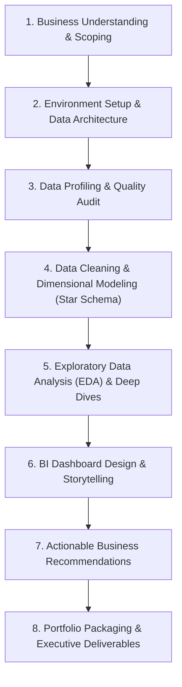
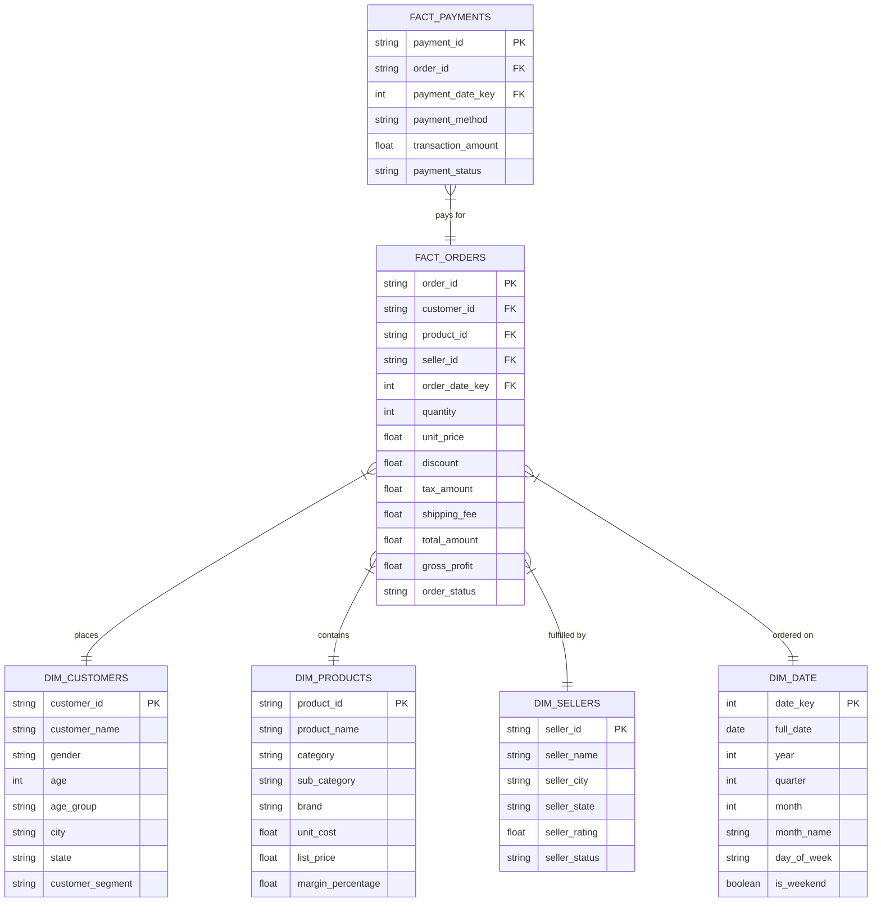

# End-to-End E-Commerce Data Analytics Project: Strategy & Guidelines

> **Project:** E-Commerce Sales Performance & Customer Behavior Analysis  
> **Datasets:** `customers.csv`, `orders.csv`, `payments.csv`, `products.csv`, `sellers.csv`  
> **Scope:** End-to-End Data Analytics Lifecycle (Data Audit, Cleaning, Modeling, EDA, BI Dashboard, Advanced Analytics, Business Recommendations)

---

## Project Lifecycle Roadmap



---

## Phase 1: Business Understanding & Project Scoping

### 1. Core Executive Objectives
- **Revenue & Growth:** Quantify historical sales trajectory, Year-over-Year (YoY) and Month-over-Month (MoM) growth rates, and Average Order Value (AOV).
- **Customer Lifetime Value & Churn:** Pinpoint repeat purchase rates, customer retention trends, and high-value customer cohorts.
- **Logistics & Delivery SLAs:** Identify transit bottlenecks, shipping delays across states, and regional fulfillment performance.
- **Payment & Risk Funnel:** Analyze payment gateway failure rates, refund volume, and Cash on Delivery (COD) cancellation patterns.
- **Product Profitability:** Uncover margin dilution where promotional discounting leads to negative gross profits.

### 2. Stakeholder Personas & Key Questions

| Stakeholder Persona | Strategic Business Questions |
| :--- | :--- |
| **Chief Commercial Officer (CCO)** | What is our net revenue growth trajectory? What is the blended gross profit margin across categories? |
| **Marketing & Growth Team** | Who are our VIP and champion customers (RFM)? Which customer segments are at risk of churning? |
| **Logistics & Supply Chain** | Which states or routes experience the highest delivery delays? Does delivery latency correlate with returns? |
| **Product & Category Managers** | Which top 20% of products generate 80% of revenue? Which SKUs operate at negative gross margin? |
| **Finance & Payments Team** | What is the transaction success rate across payment methods (UPI, Cards, COD)? What is the refund exposure? |

---

## Phase 2: Project Architecture & Environment Setup

### Recommended Directory Structure

```text
ecommerce-analytics/
├── data/
│   ├── raw/                 # Original, immutable raw CSV files
│   ├── processed/           # Cleaned, standardized CSV/Parquet tables
│   └── data_dictionary.md   # Detailed schema and metric definitions
├── notebooks/
│   ├── 01_data_profiling.ipynb
│   ├── 02_data_cleaning_etl.ipynb
│   ├── 03_exploratory_data_analysis.ipynb
│   └── 04_customer_segmentation_rfm.ipynb
├── sql/
│   ├── ddl_star_schema.sql  # DDL for Fact and Dimension tables
│   └── transformations.sql  # SQL transformation & business KPI logic
├── dashboards/              # Power BI (.pbix) / Tableau / Streamlit files
├── docs/                    # Architecture diagrams & executive report
├── PROJECT_STRATEGY_GUIDELINES.md
└── README.md
```

### Recommended Technology Stack
- **Data Transformation & Cleaning:** Python (`pandas`, `numpy`, `polars`) or SQL (`DuckDB`, `PostgreSQL`, `BigQuery`)
- **Dimensional Modeling:** Kimball Star Schema methodology
- **Advanced Analytics & Clustering:** `scikit-learn` (RFM K-Means clustering, Cohort analysis)
- **Data Visualization & BI:** Power BI, Tableau, or Streamlit with `matplotlib` / `seaborn` / `plotly`
- **Version Control:** Git & GitHub

---

## Phase 3: Data Profiling & Quality Audit (Diagnosing the Mess)

Audit all raw datasets across the **5 core dimensions of data quality**: Completeness, Uniqueness, Validity, Consistency, and Accuracy.

| Dataset | Observed Data Quality Anomalies & Issues | Audit & Remediation Strategy |
| :--- | :--- | :--- |
| **`customers.csv`** | • Inconsistent gender strings (`FEMALE`, `F`, `male`, `M`, `Unknown`, blanks)<br>• Invalid age values (e.g. negative ages `-5`, extremes `> 100`)<br>• Malformed contact details (missing phone numbers, non-standard prefixes)<br>• Geographic mismatch (e.g., Indore labeled under Tamil Nadu) | Standardize gender casing into enum (`Male`, `Female`, `Unknown`); impute or filter invalid ages; clean telephone formatting; flag geographic inconsistencies. |
| **`orders.csv`** | • Invalid quantities (e.g. `-5`, `0`) and dummy prices (`999999.0`)<br>• Order status casing (`delivered`, `DELIVERED`, `Delivered`, `shipped`, `canceled`)<br>• Math discrepancy: `(qty * price) - discount + tax + shipping != total_amount`<br>• Temporal violations: `delivery_date` occurring before `order_date` | Filter/flag negative quantities as returns; standardize status values; recompute financial columns; flag chronological date errors. |
| **`payments.csv`** | • Null payment methods and missing transaction timestamps<br>• Payment amount vs order total reconciliation mismatches<br>• Status conflict: Order marked `Delivered` but Payment marked `Failed` | Impute missing methods based on order data; reconcile transaction amounts against order totals; harmonize cross-table status integrity. |
| **`products.csv`** | • Missing brand names (nulls / blank strings)<br>• Negative list prices (`-100.0`)<br>• Negative gross margin where `list_price < unit_cost` | Fill missing brand with `'Generic'`; enforce `list_price > 0`; compute margin percentage and flag negative-margin SKUs. |
| **`sellers.csv`** | • Null or out-of-range seller ratings<br>• Mixed seller status flags (`Active`, `Banned`, `Inactive`)<br>• City/state geographic mismatches | Impute missing ratings with category average; isolate banned sellers to evaluate historical impact; validate city/state consistency. |

> [!IMPORTANT]
> **Milestone Deliverable:** Generate a **Data Quality Audit Report** documenting null counts, duplicate records, outlier thresholds, and foreign key orphan rates before executing transformations.

---

## Phase 4: Data Cleaning & Dimensional Modeling (Star Schema)

### 1. Systematic Data Cleaning Rules
- **Categorical Normalization:** Map diverse string representations to consistent enum values (`order_status`: `Delivered`, `Shipped`, `Cancelled`, `Pending`).
- **Anomaly Treatment:** Replace extreme ages (`< 15` or `> 100`) with cohort median or label as `Unknown`. Separate negative quantities into return transactions.
- **Date Standardization:** Convert all timestamp strings to standard ISO format (`YYYY-MM-DD HH:MM:SS`). Compute duration metrics:
  $$\text{Lead Time (Days)} = \text{delivery\_date} - \text{order\_date}$$
- **Financial Metric Recalculation:**
  $$\text{Gross Revenue} = \text{Quantity} \times \text{Unit Price}$$
  $$\text{Net Revenue} = \text{Gross Revenue} - \text{Discount}$$
  $$\text{Reconciled Total} = \text{Net Revenue} + \text{Tax Amount} + \text{Shipping Fee}$$
  $$\text{Gross Profit} = \text{Net Revenue} - (\text{Quantity} \times \text{Unit Cost})$$

### 2. Star Schema Architecture



---

## Phase 5: Exploratory Data Analysis & Deep Dives

### 1. Revenue & Sales Velocity Analysis
- **Time-Series Analysis:** Monthly/Quarterly Revenue growth, Gross Merchandise Value (GMV), Net Revenue (excluding cancellations/refunds).
- **AOV & Basket Size:** Average Order Value by category and customer tier.

### 2. Customer Segmentation (RFM Analysis)
Segment customers based on purchasing recency, frequency, and monetary spend:

| Segment | Recency (R) | Frequency (F) | Monetary (M) | Recommended Business Action |
| :--- | :--- | :--- | :--- | :--- |
| **Champions / VIPs** | High | High | High | Loyalty rewards, early product access, VIP concierge support. |
| **Loyal Customers** | Moderate | High | Moderate-High | Upsell premium product lines, subscription tier invitations. |
| **Potential Loyalists**| High | Moderate | Moderate | Targeted cross-sell recommendations and bundle discounts. |
| **At-Risk Customers** | Low | High | High | Automated win-back campaigns with limited-time reactivation coupons. |
| **Lost / Churned** | Low | Low | Low | Low-cost email re-engagement campaigns or exit sentiment surveys. |

### 3. Product & Inventory Profitability
- **Gross Margin Analysis:** Filter SKUs where `gross_profit < 0` due to promotional over-discounting.
- **Pareto Principle (80/20 Rule):** Identify the top 20% of catalog items driving 80% of top-line revenue.
- **Slow-Moving SKUs:** High stock quantity with low order velocity over 90+ days.

### 4. Logistics & SLA Performance
- **Order-to-Delivery Lead Time:** Average days by state/region and by seller.
- **Correlation Analysis:** Impact of shipping delays on customer review scores ($1\text{ to }5$) and cancellation probability.

### 5. Payment Gateway Health & Risk
- Gateway success/failure rate across methods: UPI, Credit Card, Debit Card, Net Banking, Wallet, COD.
- Cancellation and Return to Origin (RTO) rate comparison between prepaid and COD orders.

---

## Phase 6: Business Intelligence Dashboard Design

Build an interactive 4-page dashboard in **Power BI**, **Tableau**, or a **web dashboard application**:

```
┌────────────────────────────────────────────────────────────────────────┐
│                        EXECUTIVE KPI DASHBOARD                         │
├──────────────┬──────────────┬──────────────┬─────────────┬─────────────┤
│  NET REVENUE │ TOTAL ORDERS │     AOV      │ GROSS MARGIN│ ON-TIME SLA │
│   $18.4M     │    380.2K    │    $48.39    │    28.4%    │    92.1%    │
├──────────────┴──────────────┴──────────────┴─────────────┴─────────────┤
│  [ Monthly Revenue Trend Line Chart ]     [ Category Revenue Donut ]   │
│                                                                        │
│  [ Regional Sales & Delay Heatmap   ]     [ Top 10 Bestselling SKUs]   │
└────────────────────────────────────────────────────────────────────────┘
```

1. **Page 1: Executive KPI Scorecard:**
   - Metric cards: Net Revenue, Total Orders, AOV, Gross Margin %, SLA Compliance %.
   - Monthly revenue trajectory with YoY comparisons and category contribution breakdown.
2. **Page 2: Customer & RFM Intelligence:**
   - Interactive RFM segment distribution treemap, Customer Lifetime Value (CLV) cohorts, and retention heatmaps.
3. **Page 3: Product & Seller Performance:**
   - Scatter plot of sales volume vs margin percentage, bestsellers vs margin diluters, and seller SLA rankings.
4. **Page 4: Operations & Risk Management:**
   - Regional delivery lead times, cancellation breakdown by payment method, and gateway failure tracking.

---

## Phase 7: Actionable Business Recommendations

1. **Mitigate Cash on Delivery (COD) Risk:**
   - *Finding:* COD orders frequently demonstrate higher cancellation and Return to Origin (RTO) rates.
   - *Action:* Introduce a 2–3% instant prepaid incentive (UPI/Card discounts) to shift customer payment mix toward prepaid methods.
2. **Optimize Supply Chain & Regional Logistics:**
   - *Finding:* Specific transit corridors consistently breach expected delivery SLAs.
   - *Action:* Establish micro-fulfillment partnerships or negotiate stricter SLAs with regional 3PL logistics carriers.
3. **Automate At-Risk Customer Retention:**
   - *Finding:* Significant revenue is lost when frequent buyers become inactive for 90+ days.
   - *Action:* Trigger automated re-engagement workflows with dynamic personalized discounts for customers in the "At-Risk" RFM segment.
4. **Enforce Catalog Margin Guardrails:**
   - *Finding:* Certain products are sold at a negative gross profit margin due to compounding discounts.
   - *Action:* Implement hard price floors in the product pricing catalog preventing discounts that undercut unit acquisition cost.

---

## Phase 8: Portfolio Packaging & Executive Deliverables

To showcase this as an end-to-end data analytics portfolio project:
1. **GitHub Repository:** Clean code, modular SQL queries, and clear commit history.
2. **`README.md`:** Concise executive summary, architectural diagrams, key analytical insights, and dashboard screenshots/demos.
3. **Executive Slide Deck (5–8 Slides):** Context $\rightarrow$ Data Quality Challenges $\rightarrow$ Core Insights $\rightarrow$ Financial Impact $\rightarrow$ Actionable Roadmap.
